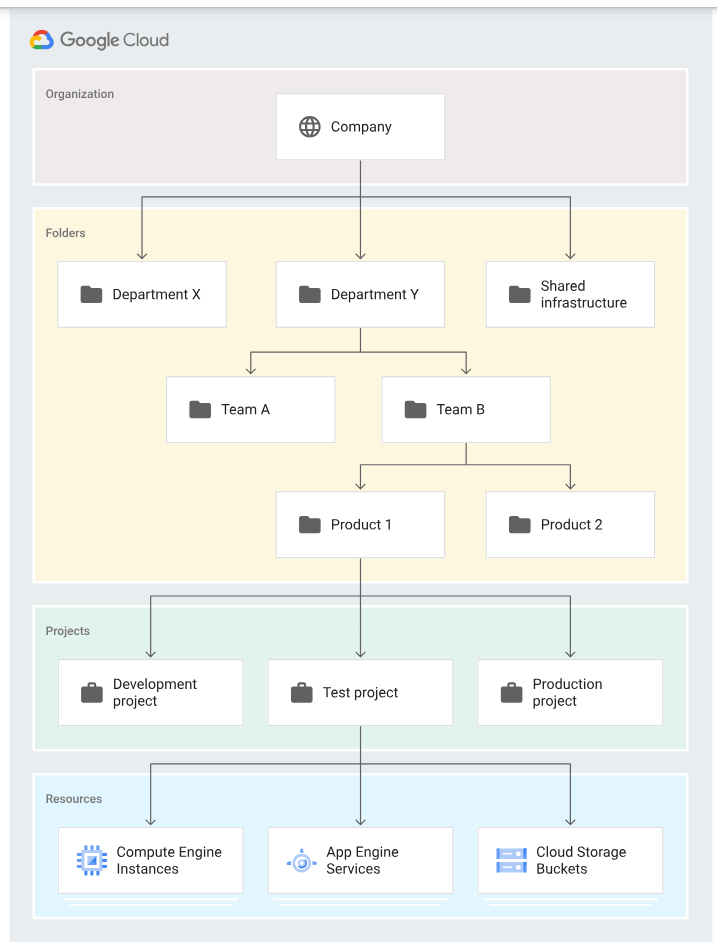

# Bigquery Roles
- BigQuery Admin
- BigQuery Connection Admin
- BigQuery Connection User
- BigQuery Data Editor: 
  - When applied to a table or view, this role provides permissions to:
    - Read and update data and metadata for the table or view
    - Delete the table or view
  - When applied to a dataset, this role provides permissions to:
    - Read the dataset's metadata and list tables in the dataset.
    - **Create**, update, get, and delete the dataset's tables
  - When applied at the project or organization level, this role can also create new datasets. 
- BigQuery Data Owner
  - When applied to a table or view, this role provides permissions to:
    - Read and update data and metadata for the table or view.
    - Share the table or view
    - Delete the table or view
  - When applied to a dataset, this role provides permissions to:
    - Read, update, and delete the dataset.
    - Create, update, get, and delete the dataset's tables.
- BigQuery Data Viewer
  - When applied to a table or view, this role provides permissions to Read data and metadata from the table or view.
  - When applied to a dataset, this role provides permissions to list all of the resources in the dataset (such as tables, views, snapshots, models, and routines) and to read their data and metadata with applicable APIs and in queries.
- BigQuery Filtered Data Viewer: Access to view filtered table data defined by a row access policy 
- BigQuery Job User: 
  - Provides permissions to run jobs, including queries, within the project.
- BigQuery Metadata Viewer
- **BigQuery User**
  - When applied to a dataset, this role provides the ability to read the dataset's metadata and list tables in the dataset.
  - When applied to a project, this role also provides the ability to 
    - run jobs, including queries, within the project.
    - A principal with this role can enumerate their own jobs, cancel their own jobs, and enumerate datasets within a project.
    - Additionally, allows the creation of new datasets within the project; the creator is granted the BigQuery Data Owner role

#  Resource hierarchy
[]

#### Organization
The organization resource represents an organization (for example, a company) and is the root node in the Google Cloud resource hierarchy when present.

The organization resource is the hierarchical ancestor of folder and project resources. The IAM access control policies applied on the organization resource apply throughout the hierarchy on all resources in the organization.

A Google Workspace or Cloud Identity account can have exactly one organization resource provisioned with it.

#### The folder resource
Folder resources optionally provide an additional grouping mechanism and isolation boundaries between projects.

Folder resources can be used to model different legal entities, departments, and teams within a company.

#### The project resource
The project resource is the base-level organizing entity. Organization and folder resources may contain multiple projects. 

A project resource is required to use Google Cloud.

# Cloud Data Loss Prevention API
Use it for redacting sensitive data like personally Identifiable Data.

##  InfoType detector reference
Sensitive Data Protection uses information types—or infoTypes—to define what it scans for. An infoType is a type of sensitive data, such as a name, email address, telephone number, identification number, or credit card number.

# Encrytion and Security
Check the notes in Notes/Encryption