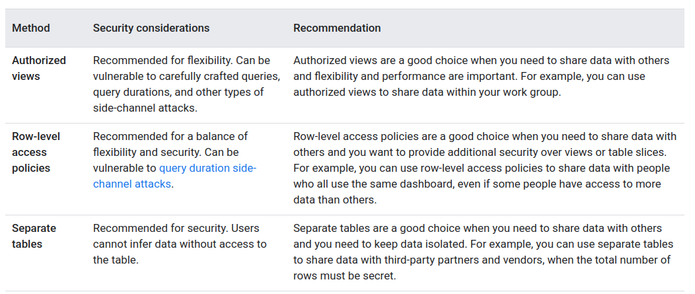

## BigQuery: Controlling access to datasets

### Authorized Views
As a data administrator, you can create an authorized view to share a subset of data in a dataset to specific users and groups (principals).

Principals can view the data you share and run queries on it, but they can't access the source dataset directly.

#### Views 
A logical view is the default view type for BigQuery, and a materialized view is a precomputed view that periodically caches the results of a query for increased performance and efficiency.

An authorized view for a logical view is called an authorized view, but an authorized view for a materialized view is called an authorized materialized view.

Storing data in a separate table is the most secure but least flexible method. Setting row-level policies is flexible and secure, while sharing authorized views is flexible and provides the best performance.

### Column Level Security
BigQuery provides fine-grained access to sensitive columns using policy tags, or type-based classification, of data.

You can create policies that check, at query time, whether a user has proper access.

#### Column-level access control workflow

- Define a taxonomy and policy tags. Create and manage a taxonomy and policy tags for your data. For guidelines, see Best practices for policy tags.

- Assign policy tags to your BigQuery columns. In BigQuery, use schema annotations to assign a policy tag to each column where you want to restrict access.

- Enforce access control on the taxonomy. Enforcing access control causes the access restrictions defined for all of the policy tags in the taxonomy to be applied.

- Manage access on the policy tags. Use Identity and Access Management (IAM) policies to restrict access to each policy tag. The policy is in effect for each column that belongs to the policy tag.


### Row level Security
Row-level security lets you filter data and enables access to specific rows in a table based on qualifying user conditions.

At a high level, row-level security involves the creation of row-level access policies on a target BigQuery table. These policies act as filters to hide or display certain rows of data, depending on whether a user or group is in an allowed list. Any users or groups not specifically included in the allowed list are denied access.

```
CREATE TABLE IF NOT EXISTS
  dataset1.table1 (partner STRING,
    contact STRING,
    country STRING,
    region STRING);
INSERT INTO
  dataset1.table1 (partner,
    contact,
    country,
    region)
VALUES
  ('Example Customers Corp', 'alice@examplecustomers.com', 'Japan', 'APAC'),
  ('Example Enterprise Group', 'bob@exampleenterprisegroup.com', 'Singapore', 'APAC'),
  ('Example HighTouch Co.', 'carrie@examplehightouch.com', 'USA', 'US'),
  ('Example Buyers Inc.', 'david@examplebuyersinc.com', 'USA', 'US');
```

```
CREATE ROW ACCESS POLICY
  us_filter
ON
  dataset1.table1 GRANT TO ("group:sales-us@example.com",
"user:jon@example.com")
FILTER USING
  (region="US");
```

### Data Masking
BigQuery supports data masking at the column level. You can use data masking to selectively obscure column data for users groups, while still allowing them access to the column.

#### Data masking rules
When you use data masking, a data masking rule is applied to a column at query runtime, based on the **role of the user** running the query. Masking takes precedence to any other operations involved in the query. The data masking rule determines the type of data masking applied to the column data.

- Custom masking routine. Limited support for any types other than STRING and BYTES.
- Date year mask. Returns the column's value after truncating the value to its year.
- Default masking value. Returns a default masking value for the column based on the column's data type. Use this if you want to reveal data type.
- Email mask. Returns the column's value after replacing the username of a valid email with XXXXX. If the column's value is not a valid email address, then it returns the column's value after it has been run through the SHA-256 hash function. You can only use this rule with columns that use the STRING data type.
- First four characters. Returns the first 4 characters of the column's value, replacing the rest of the string with XXXXX.
- Hash (SHA-256). Returns the column's value after it has been run through the SHA-256 hash function. Use this when you want the end user to be able to use this column in a JOIN operation for a query. You can only use this rule with columns that use the STRING or BYTES data types.
- Last four characters. Returns the last 4 characters of the column's value, replacing the rest of the string with XXXXX.
- Nullify. Returns NULL instead of the column value.


### Differential privacy
Differential privacy is a standard for computations on data that limits the personal information that's revealed by an output. Differential privacy is commonly used to share data and to allow inferences about groups of people while preventing someone from learning information about an individual.

### Data governance comparison
[]


## BigQuery Data Transfer Service
The BigQuery Data Transfer Service automates data movement into BigQuery on a **scheduled**, managed basis.


## Table Partitioning and Clustering
You can combine table partitioning with table clustering to achieve finely grained sorting for further query optimization.

Use clustering if cardinality is high.

Allows for block pruning where only the block with range within which data exists is loaded.

You can combine partitioning with clustering. Data is first partitioned and then data in each partition is clustered by the clustering columns.

## Bigquery Roles
- BigQuery Admin
- BigQuery Connection Admin
- BigQuery Connection User
- BigQuery Data Editor: 
  - When applied to a table or view, this role provides permissions to:
    - Read and update data and metadata for the table or view
    - Delete the table or view
  - When applied to a dataset, this role provides permissions to:
    - Read the dataset's metadata and list tables in the dataset.
    - **Create**, update, get, and delete the dataset's tables
  - When applied at the project or organization level, this role can also create new datasets. 
- BigQuery Data Owner
  - When applied to a table or view, this role provides permissions to:
    - Read and update data and metadata for the table or view.
    - Share the table or view
    - Delete the table or view
  - When applied to a dataset, this role provides permissions to:
    - Read, update, and delete the dataset.
    - Create, update, get, and delete the dataset's tables.
- BigQuery Data Viewer
  - When applied to a table or view, this role provides permissions to Read data and metadata from the table or view.
  - When applied to a dataset, this role provides permissions to list all of the resources in the dataset (such as tables, views, snapshots, models, and routines) and to read their data and metadata with applicable APIs and in queries.
- BigQuery Filtered Data Viewer: Access to view filtered table data defined by a row access policy 
- BigQuery Job User: 
  - Provides permissions to run jobs, including queries, within the project.
- BigQuery Metadata Viewer
- **BigQuery User**
  - When applied to a dataset, this role provides the ability to read the dataset's metadata and list tables in the dataset.
  - When applied to a project, this role also provides the ability to 
    - run jobs, including queries, within the project.
    - A principal with this role can enumerate their own jobs, cancel their own jobs, and enumerate datasets within a project.
    - Additionally, allows the creation of new datasets within the project; the creator is granted the BigQuery Data Owner role
