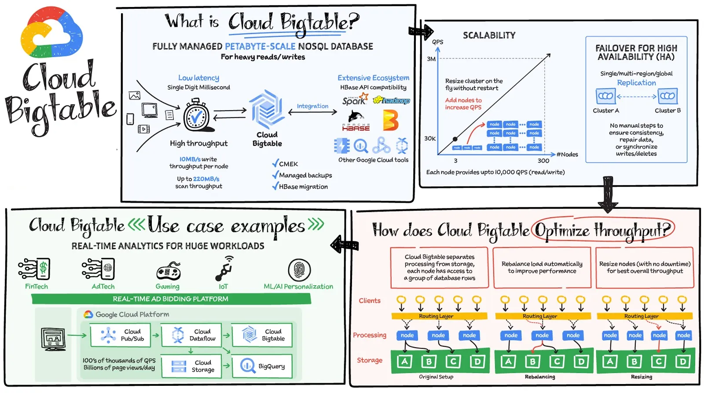
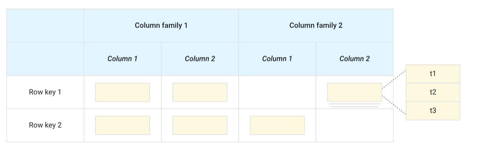
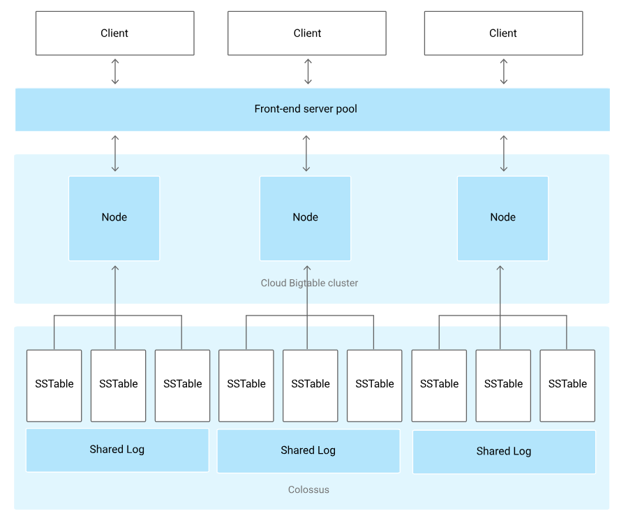

### Introduction to Google Cloud Bigtable
Highly scalable NoSQL, wide column database designed for handling large volumes of data efficiently.

[]

Bigtable is a sparsely populated table that can scale to billions of rows and thousands of columns, enabling you to store terabytes or even petabytes of data.
A single value in each row is indexed; this value is known as the row key.
Bigtable is ideal for storing large amounts of single-keyed data with low latency. It supports high read and write throughput at low latency, and it's an ideal data source for MapReduce operations.

Bigtable is **ideal** for applications that **need high throughput and scalability** for **key-value data**, where each value is typically no larger than 10 MB. Bigtable also excels as a storage engine for batch MapReduce operations, stream processing/analytics, and machine-learning applications.

- **Time-series data**, such as CPU and memory usage over time for multiple servers.
- **Marketing data**, such as purchase histories and customer preferences.
- **Financial data**, such as transaction histories, stock prices, and currency exchange rates.
- **Internet of Things** data, such as usage reports from energy meters and home appliances.
- **Graph data**, such as information about how users are connected to one another.

types of apps where you’d consider using Bigtable:
recommendation engines, personalizing user experience,Internet of Things, real-time analytics, fraud detection, migrating from HBase or Cassandra, Fintech, gaming, high-throughput data streaming for creating / improving ML models.

#### Bigtable vs BigQuery
Bigtable is optimised for: **Point read/write** and typical target is **User/Entity level**.
Bigquery is optimsed for **Ad-hoc analysis and reporting**  and it starget is **Cohort/Population**

### Bigtable storage model
Bigtable stores data in massively scalable tables, each of which is a sorted key-value map.
- The table is composed of rows, each of which typically describes a **single entity**, and columns, which contain **individual values** for each row.
- Each row is **indexed** by a **single row key**, and **columns** that are re**l**ated to one another are typically **grouped** into a **column family**.
- Each column is **identified** by a **combination** of the **column family** and a **column qualifier**, which is a unique name within the column family.
- Each **intersection** of a **row** and **column** can contain **multiple cells**. Each cell contains a **unique timestamped** version of the data for that row and column.
- Storing multiple cells in a column provides a **record** of how the stored data for that row and column has **changed over time**.
- Bigtable **tables are sparse**; if a column is not used in a particular row, it does not take up any space.

[]

### Bigtable architecture
[]

- All client requests go through a frontend server before they are sent to a Bigtable node.
- The nodes are organized into a Bigtable cluster, which belongs to a Bigtable instance, a container for the cluster.
- Each node in the cluster handles a subset of the requests to the cluster. By adding nodes to a cluster, you can increase the number of simultaneous requests that the cluster can handle. Adding nodes also increases the maximum throughput for the cluster.
- If you enable replication by adding additional clusters, you can also send different types of traffic to different clusters. Then if one cluster becomes unavailable, you can fail over to another cluster.
- A Bigtable table is sharded into **blocks of contiguous rows, called tablets**, to help balance the workload of queries.
- Tablets are **stored on Colossus**, Google's file system, in **SSTable** format. An SSTable provides a persistent, ordered immutable map from keys to values, where both keys and values are arbitrary byte strings.
- Each **tablet** is **associated** with a specific **Bigtable node**. In addition to the SSTable files, all writes are stored in Colossus's shared log as soon as they are acknowledged by Bigtable, providing increased durability.
- data is never stored in Bigtable nodes themselves; each node has pointers to a set of tablets that are stored on Colossus


### Replication in BigTable
Increase the availability and durability of your data by copying it across multiple regions or multiple zones within the same region. You can also isolate workloads by routing different types of requests to different clusters.

Needs an instance with more than 1 cluster.
As each zone can have only 1 cluster.  Having clusters in different zones or regions lets you access your instance's data even if one Google Cloud zone or region becomes unavailable.

When you create an instance with more than one cluster, Bigtable immediately starts to synchronize your data between the clusters, creating a separate, independent copy of your data in each zone where your instance has a cluster.  
Similarly, when you add a new cluster to an existing instance, Bigtable copies your existing data from the original cluster's zone to the new cluster's zone, then synchronizes changes to your data between the zones.

Replication has some latency, and **consistency between clusters is eventual**.

#### Consistency
- Eventual consistency
- Read-your-writes consistency
- Strong consistency

### BigTable Tables

#### Tables
A Bigtable table is a sorted key-value map that stores data in rows and columns. Each row is indexed by a single, unique row key. Columns that are related to one another are typically grouped into a column family.

Tables are sparse.

In a row, a column can contain multiple cells, each identified by the four-tuple (row key, column family, column qualifier, timestamp). Storing multiple cells in a column provides a record of how the stored data for that row and column has changed over time.

A Bigtable table doesn't support joins, and transactions are supported only within a single row.

**Bigtable has a limit of 1,000 tables per instance**.

#### Views
##### Logical Views

##### Continuous materialized views
A continuous materialized view is created by continuously running a SQL query against a Bigtable table. Bigtable creates a new table based on the query output and keeps it in sync with the source table.

Continuous materialized views are read-only. You are charged for storage of a continuous materialized view as well as for the processing work that goes into creating the second table, keeping it in sync with the source table, and replicating it.

##### Authorized views
Authorized views are views of tables that you configure to include specific table data and then grant access to separately from access to the source table. An authorized view is defined by a JSON-formatted definition file.


## BigTable Schema Design
### Best Practice

#### Tables
**Store datasets with similar schemas in the same table**, rather than in separate tables.

#### Column Families
Put related columns in the same column family.

Create up to about 100 column families per table. Creating more than 100 column families may cause performance degradation.

Choose short names for your column families.

Put columns that have different data retention needs in different column families.

#### Columns
Create as many columns as you need in the table.

Avoid using too many columns in any single row.

Optionally, you can treat column qualifiers as data.

#### Rows
Keep the size of all values in a single row under 100 MB.

Keep all information for an entity in a single row.

Store related entities in adjacent rows.

#### Cells
Don't store more than 10 MB of data in a single cell.

Use aggregate cells to store and update aggregate data.

#### Row keys
Design your row key based on the queries you will use to retrieve the data.  
The most efficient Bigtable queries retrieve data using one of the following:
- Row key
- Row key prefix
- Range of rows defined by starting and ending row keys

Other types of queries trigger a full table scan, which is much less efficient.

**Keep your row keys short**. A row key must be **4 KB or less**. Long row keys take up additional memory and storage and increase the time it takes to get responses from the Bigtable server.

**Store multiple delimited values in each row key**. Because the best way to query Bigtable efficiently is by row key, it's often useful to include multiple identifiers in your row key. When your row key includes multiple values, it's especially important to have a clear understanding of how you use your data.

If your data includes integers that you want to store or sort numerically, **pad the integers with leading zeroes**.  
Bigtable stores data lexicographically.

It's important to **create a row key that makes it possible to retrieve a well-defined range of rows**. Otherwise, your query requires a table scan, which is much slower than retrieving specific rows.

For example, if your application tracks mobile device data, you can have a row key that consists of device type, device ID, and the day the data is recorded. Row keys for this data might look like this:
```
phone#4c410523#20200501
phone#4c410523#20200502
tablet#a0b81f74#20200501
tablet#a0b81f74#20200502
```

##### Row keys to avoid
- Row keys that start with a timestamp
- Row keys that cause related data to not be grouped
- Sequential numeric IDs
- Frequently updated identifiers
- Hashed values
- Values expressed as raw bytes

#### Special use cases
#### Time-based data
If you include timestamps in the row key, **don't use a timestamp by itself or at the beginning of a row key**.

If you usually retrieve the most recent records first in your queries, a pattern to consider is using **reversed timestamps** in the row key.

#### Multi-tenancy
Row key prefixes provide a scalable solution for a "multi-tenancy" use case, a scenario in which you store similar data, using the same data model, on behalf of multiple clients. Using one table for all tenants is the most efficient way to store and access multi-tenant data.

```
altostrat#phone#4c410523#20190501
altostrat#phone#4c410523#20190502
altostrat#tablet#a0b41f74#20190501
examplepetstore#phone#4c410523#20190502
examplepetstore#tablet#a6b81f79#20190501
examplepetstore#tablet#a0b81f79#20190502
```

## Eliminate hotspots in Cloud Bigtable
A Cloud Bigtable table is sharded into blocks of contiguous rows, called tablets.  
Each tablet is associated with a Bigtable node (or “tablet server”).  

A hot tablet is a tablet that uses a disproportionately large percentage of a node’s CPU compared to other tablets associated with that node. This unbalanced usage can happen due to unanticipated high volume of requests to a particular data point, or uneven table modeling during the initial schema design.

It is best to redesign the row key to ensure a single tablet does not have multiple rows that are frequently queried.