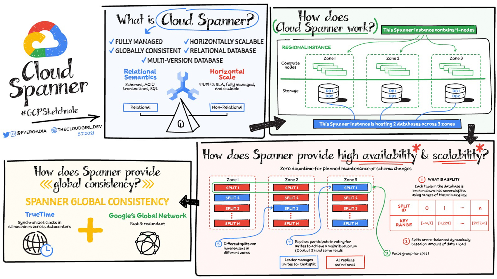
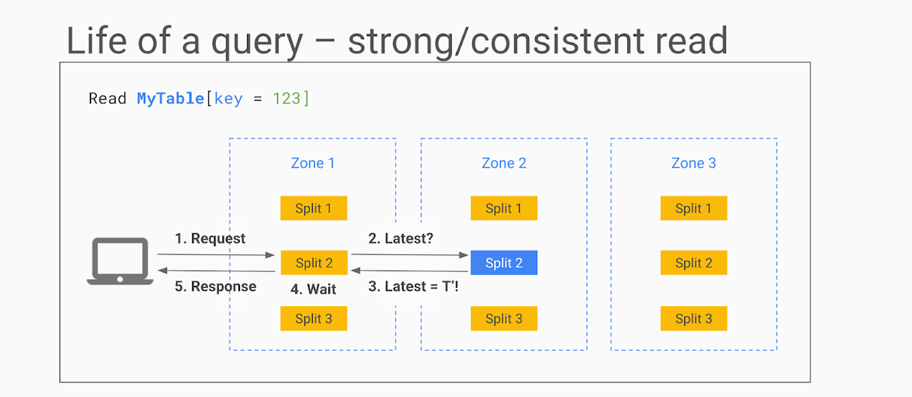
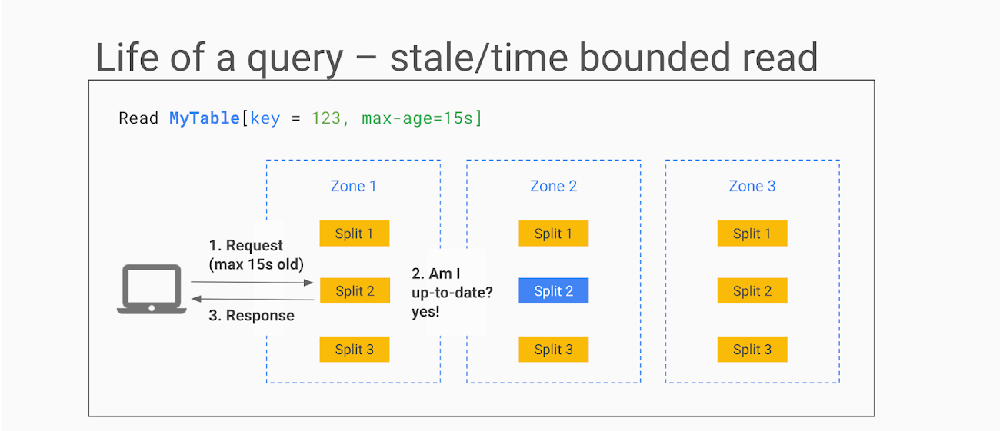
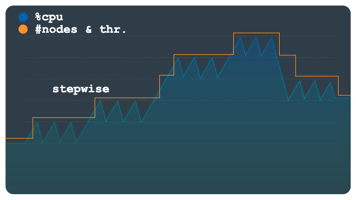
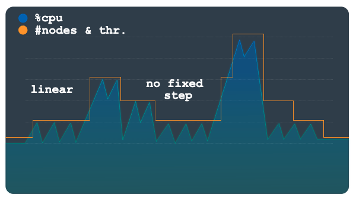
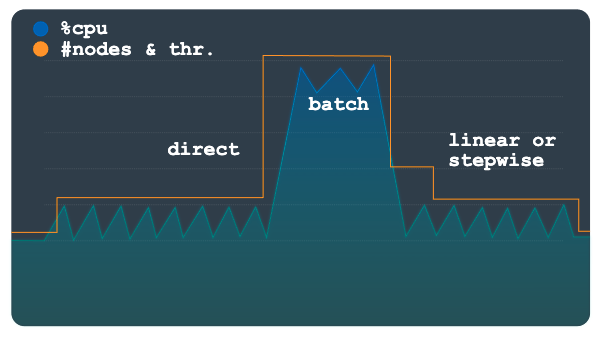

## How does Spanner work
[]

In the image you see a four-node regional Cloud Spanner instance hosting two databases.

- A node is a measure of compute in Spanner. Node servers serve the read and write/commit transaction requests, but they **don’t store** the data.
- Each node is **replicated** across three zones in the region. The database storage is also replicated across the three zones. Nodes in a zone are responsible for reading and writing to the storage in their zone.
- The data is stored in Google’s underlying C**olossus distributed replicated file system**. This provides huge advantages when it comes to redistributing load, as the data is not linked to individual nodes.
- If a node or a zone fails, the database remains available, being served by the remaining nodes. No manual intervention is needed to maintain availability.

### How does Spanner provide high availability and scalability?

- Each table in the database is stored sorted by primary key. Tables are divided by ranges of the primary key and these divisions are known as **splits**.
- Each split is managed completely independently by different Spanner nodes.
- The number of splits for a table varies according to the amount of data: empty tables have only a single split.
- The splits are rebalanced dynamically depending on the amount of data and the load (dynamic resharding).

- Everything is replicated across the three zones - the same goes for split management.
- Split replicas are associated with a group (**Paxos**) that spans zones. Using Paxos **consensus protocols**, one of the zones is determined to be a leader.
- The **leader** is **responsible** for managing **write** transactions for that split, while the other **replicas** can be used for **reads**. If a leader fails, the consensus is redetermined and a new leader may be chosen.
- For different splits, different zones can become leaders, thus distributing the leadership roles among all the Cloud Spanner compute nodes.
- **Nodes** will likely be **both leaders** for some splits and **replicas** for others.


### How do reads and writes work?
There are two types of reads in Cloud Spanner:

**Strong reads** - used when the absolute latest value needs to be read. Here is how it works:
1. The Cloud Spanner API identifies the split, looks up the Paxos group to use for the split and routes the request to one of the replicas (usually in the same zone as the client) In this example, the request is sent to the read-only replica in zone 1.
2. The replica requests from the leader if it is OK to read and it asks for the TrueTime timestamp of the latest transaction on this row.
3. The leader responds, and the replica compares the response with its own state.
4. If the row is up-to-date it can return the result.  Otherwise it needs to wait for the leader to send updates.
5. The response is sent back to the client.

In some cases, for example, when the row has just been updated while the read request is in transit, the state of the replica is sufficiently up-to-date that it does not even need to ask the leader for the latest transaction.

[]

**Stale reads** are used when low read latency is more important than getting the latest values, so some data staleness is tolerated.
- In a stale read, the client does not request the absolute latest version, just the data that is most recent (e.g. up to n seconds old).
- If the staleness factor is at least 15 seconds, the replica in most cases can simply return the data without even querying the leader as its internal state will show that the data is sufficiently up-to-date.
- You can see that in each of these read requests, no row locking was required.

[]

## Auto Scaling
Two ways of autoscaling:
- Configure your instance manually to add or remove compute capacity.
- Configure autoscaling on your instance so that compute capacity automatically scales up or down to meet workload levels.

###  Managed autoscaler
When you enable the managed autoscaler, Spanner automatically adjusts the size of your instance for you.
The managed autoscaler feature reacts to changes in your instance's workload or storage needs as your load increases or decreases.

When you configure the managed autoscaler, you can use either processing units for small instances, or nodes for large instances.
We use the term compute capacity to mean nodes or processing units.

The Spanner managed autoscaler determines how much compute capacity is required, based on the following:

- High priority CPU utilization target
- Storage utilization target
- Minimum limit
- Maximum limit

Each scaling dimension generates a recommended instance size, and Spanner automatically uses the highest one.
This means, for example, that if your instance needs 10 nodes to meet your storage utilization target but 12 nodes to meet your CPU utilization target, Spanner scales the instance to 12 nodes.

As the amount of compute capacity changes, Spanner continually optimizes the storage. It rebalances data across all servers to ensure that traffic is spread evenly and no individual server is overloaded.

**Failures**
- If the managed autoscaler scales an instance up to its maximum limit but the workload is still causing higher CPU utilization than the target, workload requests might have a higher latency or fail.
- If an instance scales up to its maximum compute capacity target but the workload needs more storage than the maximum storage limit, write requests can fail.

When Spanner scales an instance down, it removes compute capacity at a slower rate than when scaling up, to reduce any impact on latency.

#### Asymmetric read-only autoscaling
Autoscale your read-only replicas independently from other replicas.

Asymmetric read-only autoscaling lets you control the compute capacity limits and CPU utilization targets of your read-only regions based on their usage. This optimizes local read traffic patterns and improves cost efficiency.

The following autoscaling configuration parameters are configurable for each read-only replica region:
- Minimum compute capacity limit
- Maximum compute capacity limit
- High priority CPU utilization target


### Autoscaler open source tool

#### Architecture
The Autoscaler has two main components, the **Poller** and the **Scaler**. Although you can deploy the Autoscaler with varying configurations to multiple runtimes in multiple topologies with varying configurations, the functionality of these core components is the same.

##### Poller
The Poller collects and processes the time-series metrics for one or more Spanner instances. The Poller preprocesses the metrics data for each Spanner instance so that only the most relevant data points are evaluated and sent to the Scaler. The preprocessing done by the Poller also simplifies the process of evaluating thresholds for regional, dual-region, and multi-regional Spanner instances.

##### Scaler
The Scaler evaluates the data points received from the Poller component, and determines whether you need to adjust the number of nodes or processing units and, if so, by how much. The compares the metric values to the threshold, plus or minus an allowed margin, and adjusts the number of nodes or processing units based on the configured scaling method. 

#### Scaling methods
##### Stepwise
Stepwise scaling is useful for workloads that have small or multiple peaks. It provisions capacity to smooth them all out with a single autoscaling event.
[]

When the load threshold is crossed, this method provisions and removes nodes or processing units using a fixed but configurable number.

##### Linear
Linear scaling is best used with load patterns that change more gradually or have a few large peaks.
The method calculates the minimum number of nodes or processing units required to keep utilization below the scaling threshold. 
The number of nodes or processing units added or removed in each scaling event is not limited to a fixed step amount.

The sample load pattern in the following chart shows large, sudden increases and decreases in load. These fluctuations are not grouped in discernible steps as they are in the previous chart. This pattern might be better handled using linear scaling.

[]

```newSize = currentSize * currentUtilization / utilizationThreshold```

##### Direct
Direct scaling provides an immediate increase in capacity. This method is intended to support batch workloads where a predetermined higher node count is periodically required on a schedule with a known start time.
This method scales the instance up to the maximum number of nodes or processing units specified in the schedule, and is intended to be used in addition to a linear or stepwise method.

[]
