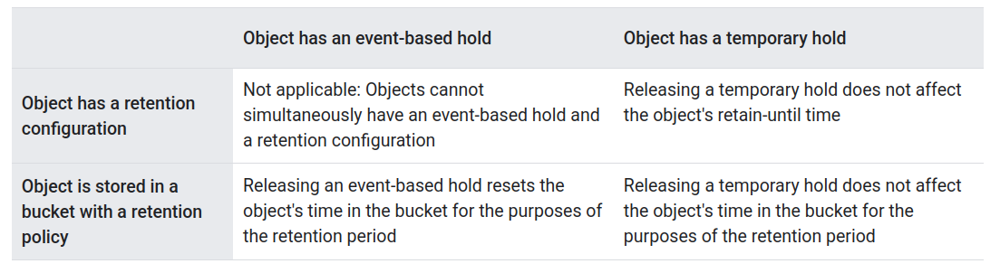
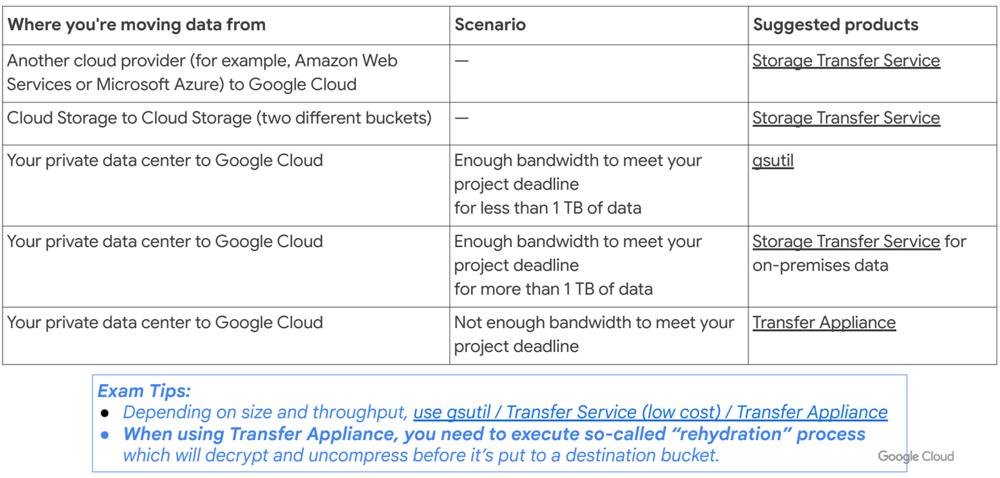

##  Data protection, backup, and recovery options

###  Bucket Lock
Configure a **Cloud Storage bucket's retention policy**. This policy governs how long objects in the bucket must be retained. The feature also lets you lock the bucket's retention policy, permanently preventing the policy from being reduced or removed.

This feature can **provide immutable storage on Cloud Storage**. In conjunction with Detailed audit logging mode, which logs Cloud Storage request and response details, Bucket Lock can help with regulatory and compliance requirements.

#### Bucket retention policies
You can include or add retention policy for **new or existing bucket**. All current and future objects in the bucket cannot be deleted or replaced until they reach the age you define in the policy.

#### General considerations
- Unless a bucket's retention policy is locked, you can **alter** (increase, decrease, or remove) the policy.
- An object's **editable metadata** is not subject to a bucket's retention policy and **can be modified** even when the object itself cannot be.
- A bucket's retention policy contains an effective time, the time after which all objects in the bucket are guaranteed to be in compliance with the retention period.

#### Considerations with other features
- In buckets that use Object Versioning, a live object version that has a **retention expiration date** in the **future** can still be **made noncurrent**, and any versioned objects that exist in the bucket at the time you apply a retention policy are also protected by the policy.
- An object that is subject to an **event-based hold** **cannot** be **deleted** while the **hold applies** to it. Once the event-based **hold is removed** from the object, the object's **retention period is reset**.
- An individual object can be subject to the bucket's retention policy and to its own, individual retention configuration.
- You can use Object Lifecycle Management to automatically delete objects in a bucket, including in a bucket with a locked policy. A lifecycle rule won't delete an object until after the object fulfills the retention policy.
- You can use the retention policy constraint in your organization policies to require that bucket retention policies with specific retention periods be included as part of creating a new bucket or as part of adding/updating the retention policy on an existing bucket.

#### Retention policy locks
When you lock a bucket's retention policy, you prevent the policy from ever being removed or the retention period from ever being reduced (although you can still increase the retention period). 

**Locking a bucket's retention policy is irreversible**

###  Object holds
Metadata flags that you place on individual objects.

Cloud Storage offers the following types of holds:
- Event-based holds: Eg. TTL 1 year.
- Temporary holds

When an object does not have a retention configuration and is stored in a bucket without a retention policy, both hold types behave exactly the same.

The following table describes how each hold type behaves if an object has a retention configuration or is stored in a bucket with a retention policy:

[]

##### The default event-based hold property
In addition to placing holds on individual objects, you can enable the default event-based property on your bucket. When you do this, each new object that subsequently gets added to the bucket automatically has an event-based hold placed on it.

This behavior is useful when you want an object to persist in your bucket for a certain length of time after a certain event occurs

#### Restrictions

- Requests that attempt to place an event-based hold on an object that has an existing retention configuration fail.
    - Requests that would simultaneously place an event-based hold on an object and set a retention configuration for the object similarly fail.
- Object holds are not supported for buckets that use hierarchical namespace.

###  Object Versioning
Object Versioning preserves deleted objects as versioned, noncurrent objects that remain accessible in your bucket until explicitly removed.

Used to track changes to objects and to enable recovery of specific versions of an object.

- Cloud Storage retains a noncurrent object version each time you replace or delete a live object version, as long as you do not specify the generation number of the live version.
- You delete a noncurrent version of an object by including the generation number in the deletion request or by using Object Lifecycle Management.
- In a bucket with soft delete enabled, when you delete a noncurrent object, Cloud Storage changes its state to soft-deleted. A soft-deleted object is permanently deleted after its soft delete retention period expires.
- Noncurrent versions of objects exist independently of any live version.

You can effectively restore a noncurrent object version to the current live version.

When you do this with Object Versioning enabled, if there already exists a live version of the object in your bucket, Cloud Storage replaces the existing live version but also retains it as a new noncurrent version. In such a case, your bucket subsequently contains the replaced object (now noncurrent) and two copies of the object that was previously noncurrent (one live copy and one still-noncurrent copy), all of which incur storage charges

###  Object Lifecycle Management
To support common use cases like **setting a Time to Live** (TTL) for objects, **retaining noncurrent versions of objects**, or **"downgrading" storage classes** of objects to help manage costs, Cloud Storage offers the Object Lifecycle Management feature.

In order to use Object Lifecycle Management, you define a lifecycle configuration, which must be set on a bucket. The configuration contains a set of rules which apply to current and future objects in the bucket. 

- An object has to match all of the conditions specified in a rule for the action in the rule to be taken.
- If multiple rules have their conditions satisfied simultaneously for a single object, Cloud Storage performs the action associated with only one of the rules, based on the following considerations:
  - The Delete action takes precedence over any SetStorageClass action.
  - The SetStorageClass action that switches the object to the storage class with the lowest at-rest storage pricing takes precedence.

In buckets with Object Versioning enabled, a live object that gets deleted according to lifecycle rules will exist in a noncurrent state for some amount of time.

###  Soft delete
Preserves objects and buckets that get deleted or overwritten for a specified period of time.

#### Soft delete policies
- Updating a bucket's soft delete policy only applies to objects that you delete after the soft delete policy takes effect.
- If you add a new soft delete retention duration to an existing bucket, it won't apply to any of the objects or buckets that were deleted before the soft delete policy takes effect.
- If you delete your project, you cannot use soft delete to restore the buckets or objects in it, even if they had soft delete enabled. Place a lien.
- If a bucket is deleted, the objects within it are not permanently deleted but cannot be listed or restored unless the soft-deleted bucket is restored first. When you restore a soft-deleted bucket, the bucket is restored without live objects in it. You'll need to either perform an object restore operation or add new objects in it.

#### Restore behavior
When you restore a soft-deleted object, Cloud Storage creates a copy of the soft-deleted object in the same bucket the object was deleted from. The restored object's metadata is the same as the metadata of the deleted object.

- A restored object always replaces its live version. If live version already exists, it gets soft deleted.
- Object copies incur charges until permanently deleted.

###  Object Retention Lock
Lets you set a retention configuration on objects within Cloud Storage buckets that have enabled the feature. A retention configuration governs how long the object must be retained and has the option to permanently prevent the retention time from being reduced or removed.

#### Considerations
- A bucket containing retained objects cannot be deleted until the retain-until time on all objects in the bucket has passed and all objects inside the bucket have been deleted.
- You can use Object Lifecycle Management to automatically delete objects, but a lifecycle rule won't delete an object until after the object has reached its retention expiration date, even if the conditions of the lifecycle rule have been met.
- In buckets that use Object Versioning, a live object version that has a retain-until time in the future can still be made noncurrent.

## GCS IAM

#### Storage Object Creator
Allows users to create objects, folders, and managed folders. Does not give permission to view, delete, or replace objects. Does not give permission to get object access control lists (ACLs) or set object ACLs as part of an object update request.

#### Storage Object Viewer
Grants access to view objects and their metadata, excluding ACLs.

Can also list the objects, folders, and managed folders in a bucket.

#### Storage Object User
Grants access to create, view, list, update, and delete objects, folders, and managed folders, along with their metadata. Does not give permission to get or set ACLs or IAM policies.

#### Storage Object Admin
Grants full control over objects and folders, including listing, creating, viewing, renaming, and deleting objects and folders, as well as setting object ACLs. Also grants access to create, delete, get, and list managed folders.

#### Storage Folder Admin
Grants full control over objects, folders, and managed folders, including listing, creating, viewing, deleting, and managing IAM permissions.

#### Storage HMAC Key Admin
Full control over HMAC keys in a project. This role can only be applied to a project.

#### Storage Admin
Grants full control of buckets, folders, managed folders, Recommender recommendations, and objects, including getting and setting object ACLs or IAM policies. Also grants full control of long-running operations and Storage Intelligence configurations.

When applied to an individual bucket, control applies only to the specified bucket and the managed folders, objects, and long-running operations within the bucket.

#### Storage Insights Admin
Grants full control of Storage Insights inventory reports and datasets.

#### Storage Insights Analyst
Grants read-only access to Storage Insights inventory reports and configurations. Also grants the ability to create a linked dataset in BigQuery that contains the output of a Storage Insights dataset.

#### Storage Insights Viewer
Grants read-only access to Storage Insights inventory reports, inventory report configurations, and dataset configurations.

#### Storage Insights Collector Service
Grants read access to object metadata in inventory reports and Storage Insights datasets.

### Access Control Lists
Each individual bucket or object can have an ACL.

Access is granted if **either IAM or ACL grants** it.

## GCS Data Transfer
[]

## GCS: Choosing a location type
#### Regional
Your data is stored in a specific region with replication across availability zones in that region. Good for colocating compute and storage for high performance (eg. data analytics).

#### Dual-region
Your data is replicated across a specific pair of regions. Good for when you need colocated compute and storage and automatic DR.

#### Multi-Region
Your data is distributed redundantly across US, EU, or Asia. Good for serving content to end users and when you want automatic failover.

## Encryption
Both CSEK and CMEK are supported